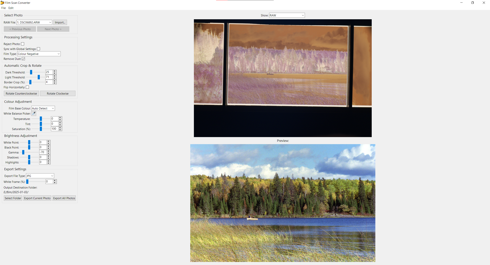

# Film Scan Converter

A standalone application used for processing RAW film scans from a digital camera into final images  

## Installation

For installing Film-Scan-Converter please check the [installation](docs/installation.md) chapter in the documentation.

## Documentation

The documentation is located in the [/docs](docs/index.md) directory and also available on [Documentation Website](https://www.example.com).

Quick Links:

- [Installation](docs/installation.md)
- [How to Use](docs/how-to-use.md)

Developer documentation and contribution guidelines are available in the [docs/developer-guide.md](docs/development/index.md) file.

## Contributing

If you're reading this, thanks for helping me take this project further beyond what I can accomplish on my own. The analog community has long been deprived of a free, intuitive, and standalone film inversion application, and your contribution will help film photography be more accessible to many more people.

Please continue reading in the [contributing](docs/contributing.md) chapter.
