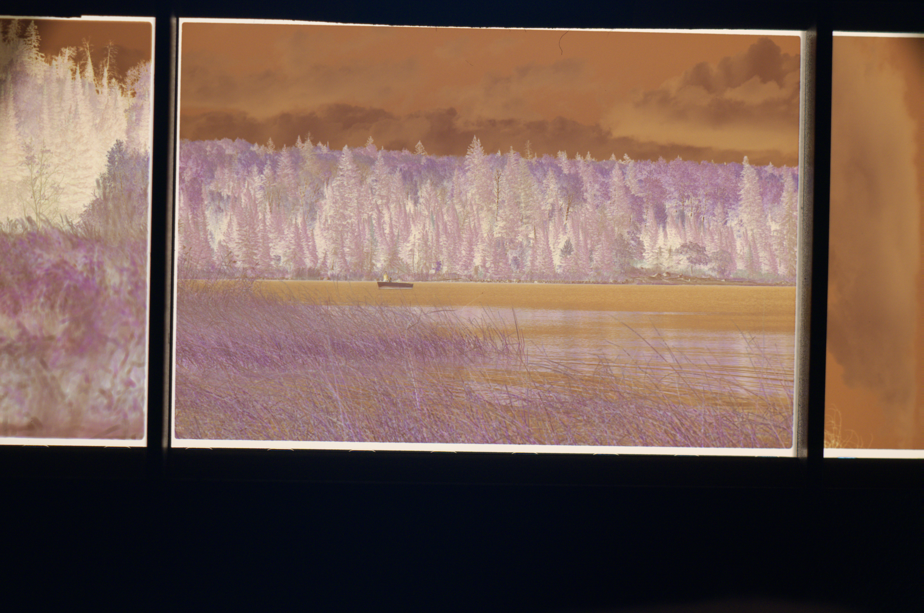
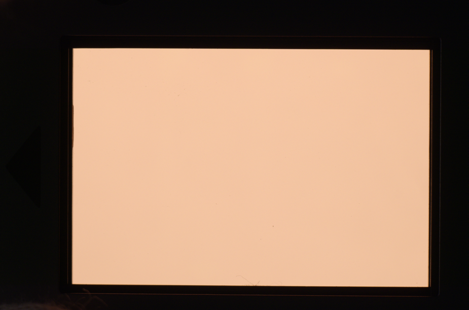

# Scanning Best Practices

Having consistent, high quality scans will go a long way to maximize the effectiveness of this application. For best results, ensure the following during scanning:

1. Use a film holder to hold the film flat and undistorted during scanning.
2. Use a reasonably accurate mask around the photo. Some film holders have notches or cutouts around the film frame; masking tape can be used to cover up the notches and square off the edges.  
_Note: It is possible to scan without a mask, however the app may have trouble distinguishing the edge of the photo from the film base, especially if the photo is underexposed._
3. Use a blower brush or equivalent to remove dust from the film before scanning.
4. Fill the image frame as much as possible with the desired photo.  
_Note: It is not critical to precisely align the photo with the image frame; the automatic cropping should take care of this._
5. Use a high CRI light source, or a high-quality LED display such as a high-end LCD or OLED display, as a backlight. Minimize stray light from external light sources.
6. Expose "to the right" of the histogram, maximizing the exposure, while ensuring that no part of the image is clipped.
7. Use a consistent exposure and orientation across the entire roll of film.
8. Capture one extra blank frame with just the film base visible, using the same exposure as the rest of the roll, with all other sources of bright lights masked out.

An ideal film scan is shown below:  

Example film base scan:
