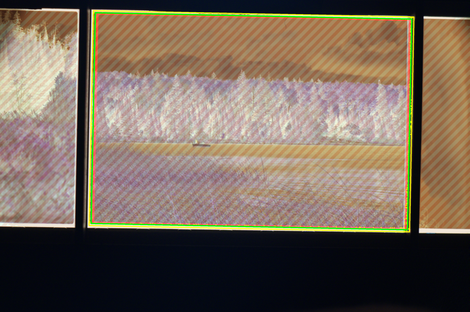
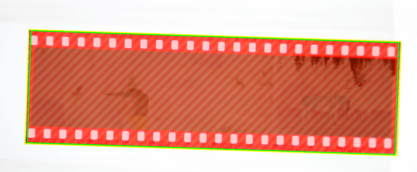

# How to Use It

## Batch Processing

This application enables you to import multiple RAW scans (most RAW image formats supported), and process them all simultaneously. Each photo's settings can either be synced with global settings, or have settings independent from all the other photos. This is useful when all the photos are scanned in a consistent manner, or you want to dial in the same "look" for multiple photos.

A potential workflow is as follows:

1. Import RAW scans from the same batch and film stock. By default, all photos are synced with global settings.
2. Set the film type (i.e. B&W, Colour, Slide).
3. Set the dark and light threshold so that most photos are cropped properly.
4. If the entire roll has been scanned on the reverse side, the image can be flipped.
5. If applicable, set the colour of the film base.
6. Go through each photo to check that it has been cropped/inverted properly. You can use the arrow keys to cycle through each photo.
7. If an individual photo needs adjustment, uncheck "Sync with Global Settings", then apply the adjustment.
8. Set the export settings, then click "Export All Photos".

## Automatic Cropping

By setting the appropriate dark and light threshold values, the application can automatically find the optimal crop around a photo, even if it is off-center or misaligned. The dark and light threshold values define the minimum and maximum brightness levels of the region of the RAW scan to highlight for retention. An appropriately thresholded image highlights most if not the entirety of the desired image, and excludes the mask and/or the film base. In the "Threshold" view, it should look like a white box surrounded by a black border, as shown below:  

You can verify that the application has detected the photo properly using the "Contours" view. The final crop of the photo is shown as a green rectangle, as shown below.  

If the mask has fuzzy edges, this may show up near the borders of the final image. You can either increase the Border Crop, or fine tune the light and dark threshold values to try to crop it out.

## Colour Correction

By default, each colour channel will be equalized such that the darkest point is pure black and the lightest point is pure white. This produces pleasing colours under most circumstances; however, there may be instances where this algorithm is thrown off by the scanning method or by the particular photo itself. If the colours look wrong in the preview, check the following:

- Is the photo cropped properly? If the final crop contains parts of the film holder or the backlight, the photo may be colour balanced against objects apart from of the photo itself.
- If shadows are the wrong colour, the film base colour is likely incorrect and will need to be manually set. This can be done by one of three ways:
  1. Pick the film base colour from the RAW scan.
  2. Set the RGB value manually.
  3. Import the blank scan of the film base from the same roll.
- If the white balance is wrong, it can be corrected by manually adjusting the temperature and tint values, or by using the white balance picker and clicking on any neutral gray portion of the image.
- If sprocket holes are desired in the final image, they will need to be masked out for the equalization calculation. This can be done by going to Edit -> Advanced Settings -> EQ Ignore Borders %, and increasing the height parameter until the sprocket holes are masked. For 35mm film, a value of 15% usually works. To visualize this masking, it is displayed in the "Contours" view as a red border within the cropped region, as shown below:  

